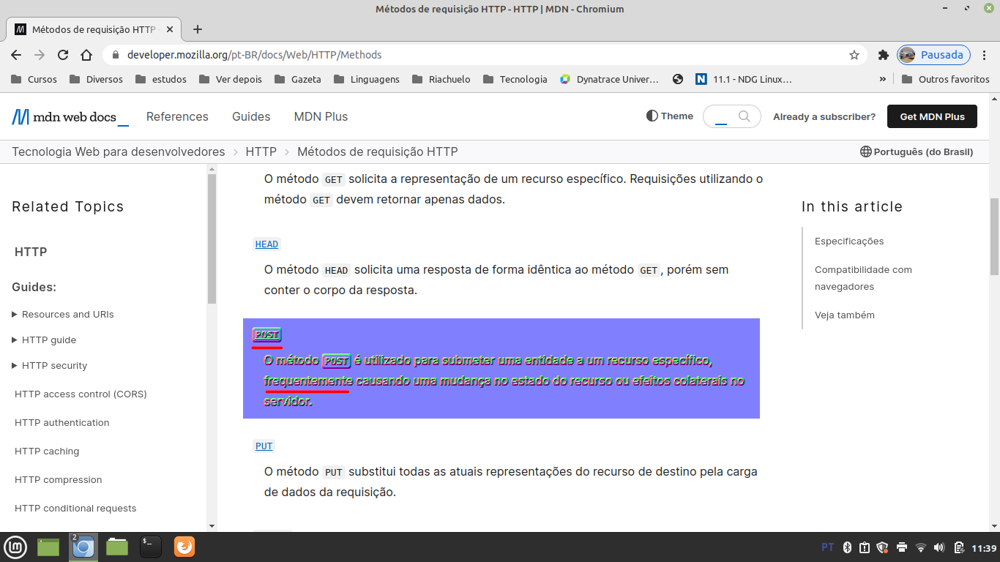

# Jankenpo

Jankenpo in PHP web version. Simple, no model, but has templates.

Why post? Well, I have this doubth. I wasn't modifying anything. Is a POST? I think is a POST, see the image below:

[A video ilustrating the system](https://www.youtube.com/watch?v=fZqGAG7y1Nc)